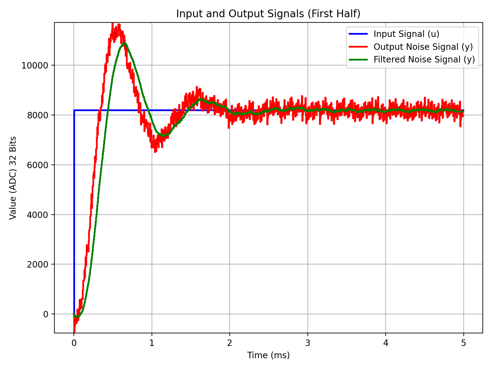

# FPGA Kalman Filter

> [!IMPORTANT]
> Project in progress .
>
> https://jlmayorga.com/fpga-kalman-filter/

This repository contains VHDL implementations and simulations for a FPGA-based Kalman filter. The project aims to compare different Kalman filter architectures and their performance on FPGA platforms.

Kalman filters represent a cornerstone in signal processing and control theory, offering an elegant solution for state estimation in dynamic systems. These filters excel in their ability to fuse noisy sensor measurements with a dynamic model of the system, providing optimal estimates of the true state. With applications spanning diverse fields such as aerospace, robotics, and finance, Kalman filters play a vital role in enabling accurate and reliable estimation, prediction, and control tasks. While their mathematical elegance and efficiency are commendable, Kalman filters do have limitations, particularly in nonlinear and non-Gaussian scenarios where extended and unscented variants are needed.

FPGAs (Field-Programmable Gate Arrays) are versatile hardware platforms that offer immense flexibility and parallel processing capabilities. Their reconfigurability allows for rapid prototyping and customization of digital circuits, making them ideal for implementing complex algorithms like Kalman filters. With FPGA-based implementations, developers can achieve real-time performance, low latency, and resource-efficient designs. However, FPGA development often requires specialized expertise and incurs higher development costs compared to software-based solutions.

Combining Kalman filters with FPGA technology unlocks a realm of possibilities for real-time signal processing applications. FPGA-based Kalman filters offer the potential for high-performance, low-latency implementations suitable for demanding scenarios such as drone navigation and power grid management. By leveraging FPGA's parallel processing capabilities, Kalman filters can efficiently handle large volumes of sensor data, enabling accurate state estimation and control in dynamic environments. However, FPGA-based solutions may face challenges related to power consumption, complexity, and scalability, requiring careful consideration in design and implementation.

In comparing Kalman filter implementations on FPGA platforms, two key applications stand out: drone navigation and power electronics in microgrid renewable energy systems. In drone navigation, FPGA-based Kalman filters can enhance onboard sensor fusion and localization, enabling precise flight control and autonomous navigation. Similarly, in microgrid systems, FPGA-based Kalman filters can optimize energy management and grid stability by accurately estimating renewable energy sources' output and predicting load demand. By comparing different Kalman filter architectures and FPGA implementations in these applications, we aim to uncover insights into their performance, efficiency, and suitability for real-world deployment.

## Experiments

The project is organized into several experiments and simulations:

- [x] **VHDL Simulation Set Up**: Set up VHDL simulation environment using GHDL and Makefiles.
- [x] **Basic Counter and Testbench Simulator**: Implement a basic counter and create a testbench simulator.
- [x] **2nd Order Linear Dynamical System Step Response Simulation**: Simulate the step response of a second-order linear dynamical system.
- [x] **Random Noise Simulator VHDL**: Implement a random noise simulator in VHDL.
- [x] **Feedback Loop Controller PID VHDL**: Implement a feedback loop controller using PID in VHDL.
- [ ] **State Space 3rd Order Linear Dynamical System Simulation**: Simulate a third-order linear dynamical system using state space representation.
- [ ] **2nd Order Kalman Filter Simulation**: Simulate a second-order Kalman filter.
- [ ] **State Space Kalman Filter 3x3 Simulation**: Simulate a state space Kalman filter with a 3x3 matrix.
- [ ] **Extended Kalman Filter Simulation**: Simulate an extended Kalman filter.
- [ ] **Distributed Kalman Filter Simulation**: Simulate a distributed Kalman filter.
- [ ] **Simulation Power System with EKF**: Simulate a power system with an extended Kalman filter.

Setting Up example

## Installing GHDL

To simulate and test the VHDL code, you will need to install GHDL, a free and open-source VHDL simulator. Follow these steps to install GHDL on your system:

### Step 1: Download GHDL

Visit the GHDL GitHub repository at [https://github.com/ghdl/ghdl](https://github.com/ghdl/ghdl) and download the latest release package for your operating system.

### Step 2: Install GHDL

Follow the installation instructions provided in the GHDL repository for your specific operating system. This typically involves extracting the downloaded package and running installation scripts or commands.

### Step 3: Verify Installation

Once GHDL is installed, open a terminal or command prompt and run the following command to verify the installation:
ghdl --version

If GHDL is installed correctly, you should see the version information printed in the terminal.

### Step 4 : How does it works

pip install pyvcd

ghdl -a full_adder.vhd
ghdl -a full_adder_testbench.vhd
ghdl -r full_adder_testbench --vcd=wave.vcd

## Using the Makefile

This project includes a Makefile to simplify the compilation, simulation, and plotting of VHDL files. Follow these steps to use the Makefile:

### Step 1: Clone the Repository

Clone this repository to your local machine using Git:
git clone https://github.com/your-username/your-repository.git

Replace `your-username` with your GitHub username and `your-repository` with the name of your repository.

### Step 2: Navigate to the Repository Directory

Open a terminal or command prompt and navigate to the directory of the cloned repository:
cd your-repository

### Step 3: Compile VHDL Files

To compile the VHDL files, run the following command:

make compile

### Step 4: Simulate

To simulate the VHDL testbench, run the following command:

make simulate

### Step 5: Plot Waveform

To plot the waveform using Python, run the following command:

make plot 

### Step 6: Clean Up

To clean up generated files, run the following command:

make clean

Feel free to customize the instructions further based on your specific project setup and requirements. Make sure to replace `your-username` and `your-repository` placeholders with your actual GitHub username and repository name.

